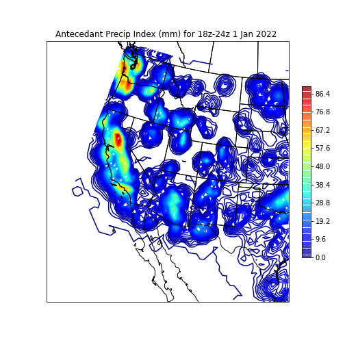
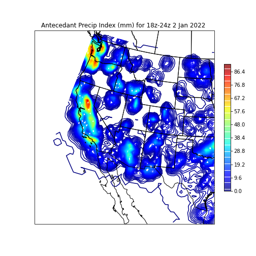
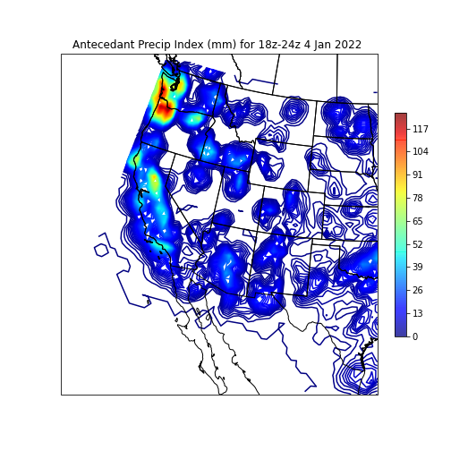
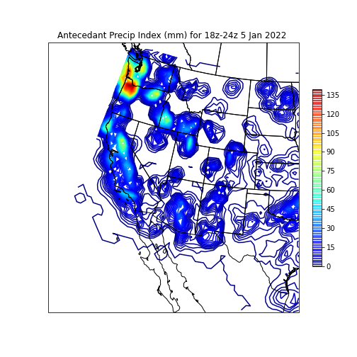
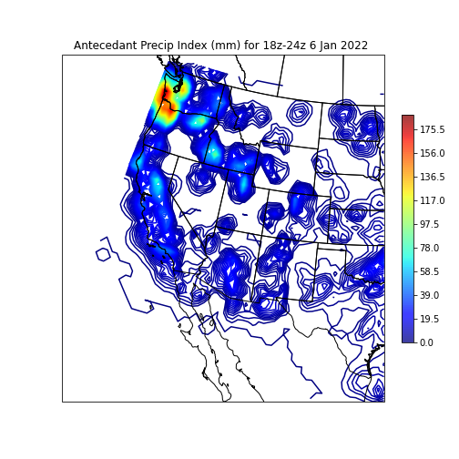
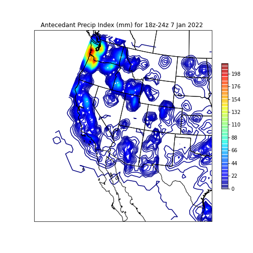
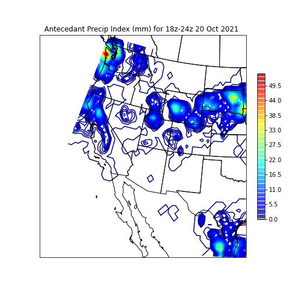

<html>
  <head>
    <meta charset="utf-8">
    <meta name="viewport" content="width=device-width, initial-scale=1">
  </head>
  <body>
    
Antecedent Precipitation Index
  

<table border="1" cellpadding="1" cellspacing="1">
    <tr>
      <th>2021</th>
      <th>2022</th>
      <th>2023</th>
      <th>2024</th>
      <th>2025</th>
      <th>2026</th>
    </tr>
    <tr>
      <td></td>
      <td></td>
    <tr>
    <tr>
      <td></td>
      <td></td>
    <tr>
    <tr>
      <td></td>
      <td></td>
    <tr>
    <tr>
      <td></td>
      <td></td>
    <tr>
    <tr>
      <td></td>
      <td></td>
    <tr>
    <tr>
      <td></td>
      <td></td>
    <tr>
    <tr>
      <td></td>
      <td></td>
    <tr>
      <td></td>
      <td></td>
      <td></td>
    </tr>
